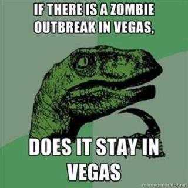

```{r setup, include=FALSE}
# To change this to a packet for printing instead of slides
# delete the line in the heading at the top that says "output:" and all the lines after it 
# up to the --- (leave the --- there)
# replace with one line that says "output: html_document" in the output field
# to any of the code chunks you want to see in the packet, add echo = TRUE 
# inside the curly brackets around the {r} at the top of the chunk like this
# {r echo=TRUE} and knit to make a packet
knitr::opts_chunk$set(message = FALSE, warning = FALSE, echo=FALSE)
```

## Schedule for today

* Peer review (last one) 
* Statistics flow chart
* Logistic regression workshop
* Challenge time

## Outline

These slides cover the basics of _logistic regression_:

* Logistic model
* Predictor significance and interpretation
* Model significance 
* Model fit 
* Assumption checking 
* Alternate models 

## What predicts becoming a zombie?

- Age was significantly associated with zombie status; zombies were older on average
- Rurality was significantly associated with zombie status; more zombies were urban, fewer were rural
- Sex was not associated with zombie status; males and females were equally likely to be zombies
- Having a week of food was associated with zombie status; those without food were more likely to be zombies

<center>
{ width=30% } </center>

## Bring in the zombie data

* Data are in a csv file saved online

```{r echo=TRUE}
# DATA IMPORT
zombies <- read.csv("http://tinyurl.com/fobzombies")
```

<center> 
{ width=40% }</center>

## Zombie variables

The zombie data includes the following: 

* **zombieid:** unique identifier for each observed person
* **age:** age in years
* **gender:** sex (female/male)
* **rurality:** lives in rural/suburban/urban area
* **household:** how many people live in the household
* **water:** gallons of water available 
* **radio:** have a battery powered radio (yes/no)
* **flashlight:** have a flashlight (yes/no)
* **firstaid:** have a first aid kit (yes/no)
* **zombie:** zombie status (zombie, not zombie)

## Logistic regression

* Logistic regression follows the principles of linear regression
* The outcome or dependent variable is _binary_ (e.g., zombie status)
* The linear regression model is transformed using the _logit transformation_ to predict the probability of the outcome of interest 
\[
p(y)=\frac{1}{1+e^{-(b_0 + b_1x_1 + b_2x_2)}} 
\]

    + y is the binary outcome variable
    + $x_1$, $x_2$, etc are predictors of the outcome (e.g., age, rurality) 
    + p(y) is the probability of the outcome (e.g., becoming a zombie)
    + $b_0$ is the y-intercept
    + $b_1$, $b_2$, etc are the slopes for $x_1$ $x_2$ 

## Modeling binary outcomes

* What predicts being a zombie (vs. non-zombie)?
    + Are the predictors statistically significantly related to zombie status?
    + Is the model statistically significantly better than the baseline?
    + How well does the model fit? 


## Null and alternate hypotheses for the predictors 

* H0: There is no relationship between age and zombie status 
* HA: There is a relationship between age and zombie status 

* H0: There is no relationship between sex and zombie status 
* HA: There is a relationship between sex and zombie status 

* H0: There is no relationship between rurality and zombie status 
* HA: There is a relationship between rurality and zombie status 

_You try it! Write the null and alternate for food access:_

* H0:  
* HA: 

## Estimating a logistic regression 

\[
p(zombie)=\frac{1}{1+e^{-(b_0 + b_1age + b_2gender + b_3rurality+b_4food)}}
\]

```{r echo = TRUE, eval = FALSE}
# estimate zombie model with age, sex, rurality
zmodel <- glm(zombie ~ age + gender + rurality + food, data = zombies,
              family = binomial(logit))
summary(zmodel)

```
## R Output for model 
```{r}
# estimate zombie model with age, sex, rurality
zmodel <- glm(zombie ~ age + gender + rurality + food, data = zombies,
              family = binomial(logit))
summary(zmodel)

```

## Significance of predictors
 
* Because the model has been transformed, the "slopes" or coefficients for the predictors cannot be directly interpreted 
* Instead, calculate odds ratios and confidence intervals for each predictor: 

```{r echo = TRUE}
# get odds ratios by exponentiating the coefficients 
oddsRatios <- exp(cbind(OR = coef(zmodel), confint(zmodel)))
oddsRatios
```

## Odds ratios and statistical significance 

* An odds ratio quantifies the increase or decrease in the odds of the outcome depending on the value of the predictor

* An odds ratio of 1 indicates that the odds of the outcome are 1 times higher/lower for group A compared to group B

* In the population, is the odds ratio different from 1? 
    + Confidence intervals with 1 in them show that the odds could be 1 in the population 
    + Confidence intervals without 1 in them show that the odds are signficantly different from 1 
    
* An odds ratio with a 95% CI that DOES NOT include 1 is statistically significant (see original output to confirm)

## Interpreting the continuous predictor odds ratios 

```{r}
oddsRatios
```

* For continuous predictors, odds ratios show increase in odds of the outcome for a one-unit increase in the predictor  

    + There is a statistically significant relationship between age and zombie status. For every one year increase in age, the odds of being a zombie increase `r round(oddsRatios[2,1], 2)` times (95% CI: `r round(oddsRatios[2,2], 2)` - `r round(oddsRatios[2,3], 2)`). 
    
## Interpreting the categorical predictor odds ratios 

```{r}
oddsRatios
```

* For categorical predictors, odds ratios show the increase or decrease in odds of the outcome for the category shown compared to the *reference* group (category not shown) 

    + There is no statistically significant relationship between sex and zombie status. 
    
    + There is a statistically significant relationship between rurality and zombie status. The odds of being a zombie are `r round(oddsRatios[4,1], 2)` times higher for suburban compared to rural areas (95% CI: `r round(oddsRatios[4,2], 2)` - `r round(oddsRatios[4,3], 2)`). The odds of being a zombie are `r round(oddsRatios[5,1], 2)` times higher for urban compared to rural (95% CI: `r round(oddsRatios[5,2], 2)` - `r round(oddsRatios[5,3], 2)`). 
    
## Interpreting odds ratios less than 1

* Occasionally you will have an odds ratio that is below 1 with a confidence interval that does not cross 1, like OR = .75 with 95% CI: .68-.84

* This can be interpreted in two ways, for example if the odds ratio for .75 were for sex and zombie status:
    + The odds of being a zombie is .75 times as high for males compare to females (95% CI: .68-.84).
    + The odds of being a zombie is 25% lower for males compared to females (OR = .75; 95% CI: .68-.84).
    
## You try it

```{r}
oddsRatios
```
  
* Interpret the odds ratio for the food variable:


## Is the model statistically significantly better than the baseline?

* The baseline is the percentage of zombies (or whatever the outcome is): 

```{r echo = TRUE}
# get baseline probability
prop.table(table(zombies$zombie))
```

* The probability of .395 or 39.5% zombies is the baseline
* Without knowing anything else, you would be more likely to predict that each person was NOT a zombie (because 60.5% are not zombies)
* Predicting everyone is not a zombie would result in the prediction being right 60.5% of the time 
* Can the model do better than that? 

## Null and Alternate Hypotheses

H0: The model is no better than the baseline percentage at predicting zombie status 
HA: The model is better than the baseline at predicting zombie status 

## Get the test statistic and p-value 

* Unfortunately the statistical test of the model does not come with the model output, so it has to be computed separately
    + The test statistic for the model is a $\chi^2$ 

```{r echo = TRUE}
# model chi-squared 
zchi <- with(zmodel, null.deviance - deviance) 
# degrees of freedom 
zdf <- with(zmodel, df.null - df.residual) 
# p-value 
zp <- with(zmodel, pchisq(zchi, zdf, lower.tail = FALSE))
# altogether
modelsig <- round(c(zchi, zdf, zp), 3) 
names(modelsig) <- c("Chi-squared", "d.f.", "p")
modelsig
```

The logistic regression model was significantly better than the baseline in predicting zombie status ($\chi^2$(`r zdf`) = `r round(zchi, 2)`; p < .05).

## Model Fit

* The last thing before putting the interpretation together is model fit 
* In linear regression the model fit is $R^2$, which is the percent of variance in the outcome accounted for by the model 
* In logistic regression the model fit is the percent correctly predicted
    + Use the model to predict the probability that each person is a zombie 
    + If the probability they are a zombie is 50% or higher, they are predicted to be a zombie 
    + If the probability they are a zombie is below 50%, they are predicted to not be a zombie 
    + Compare the predicted zombie status with the observed zombie status to see what proportion the model predicted correctly! 

## Computing Model Fit 

```{r echo = TRUE}
# predict the probability of being a zombie and round to 0 or 1
zombies$zpredict <- round(predict(zmodel, type = "response"))
# add labels of zombe not zombie
zombies$zpredict <- ifelse(zombies$zpredict == 1, "zombie", "not zombie")

# make a table of observed and predicted
library(descr)
CrossTable(zombies$zombie, zombies$zpredict,
           prop.c = FALSE, prop.chisq = FALSE, prop.t = FALSE)
```

## Interpret the model fit 
```{r}
CrossTable(zombies$zombie, zombies$zpredict,
           prop.c = FALSE, prop.chisq = FALSE, prop.t = FALSE)
```

* 166 were correctly predicted by the model out of 200
    + 105 (86.8%) of not zombies were predicted to be not zombies (correct)
    + 16 (13.2%) of not zombies were predicted to be zombies (incorrect)
    + 18 (22.8%) of zombies were predicted to be not zombies (incorrect)
    + 61 (77.2%) of zombies were predicted to be zombies (correct)

**The model correctly predicted 166/200 or 83% of the time. It was better at predicting non-zombies (86.8% correct) compared to zombies (77.2% correct).**

## Altogether

* Model significance 
* Model fit 
* Predictor odds ratios and CI 

A logistic regression model including age, sex, and rurality as predictors of zombie status was statistically significantly better than the baseline at explaining zombie status ($\chi^2$(`r zdf`) = `r round(zchi, 2)`; p < .05). The model predicted 83% of observations correctly including 86.8% of the non-zombies and 77.2% of the zombies. All three predictors were statistically significant. For every one year increase in age, the odds of being a zombie increase 1.06 times (95% CI: 1.03 - 1.08). Zombie status is not significantly associated with sex. The odds of being a zombie is 4.65 times higher for suburban compared to rural areas (95% CI: 1.84 - 12.29). The odds of being a zombie is 14.88 times higher for urban compared to rural (95% CI: 5.54 - 44.81). The odds of being a zombie is 93% lower for those with food compared to those without (95% CI: .03 - .17).
    
## Assumptions 

* Independent observations (not tested, just known) 
* No multicollinearity 
* Linearity of independent variables with the log-odds of the outcome

## Testing multicollinearity 

* The GVIF, or generalized variance inflation factor, re-runs the model for each predictor as the outcome with the other predictors as the independent variables 
* If model fit is very high for these test models, that means the predictors are strongly related and do not all need to be in the model 
* Bottom line, if the GVIF score is too high, the variable is too strongly related to another variable and should be removed 
    + A variable should be removed if $GVIF^1/2*df$ > 4

```{r echo = TRUE}
# compute GVIF for zmodel
library(car)
vif(zmodel)
```

* The last column shows the $GVIF^1/2*df$ and none are > 2
* This assumption is MET

## Testing linearity with log odds

* This assumption is only tested for continuous predictors in the model 
    + age is the only continuous predictor
* Test by plotting the predictor value on the y-axis and the logit of the outcome on the x-axis
* Minor deviations from linearity are ok, especially if monotonic

```{r echo = TRUE, eval=FALSE}
# predict the probability of zombie-ness
zombies$zpredictProb <- predict(zmodel, type = "response") 
# make a variable of the logit of the outcome
zombies$logitZombie <- log(zombies$zpredictProb/(1-zombies$zpredictProb))

# graph it with the predictor of age 
library(ggplot2)
ggplot(zombies, aes(x = logitZombie, y = age))+
  geom_point(color = "gray") +
  geom_smooth(se = FALSE, color = "orange") + 
  geom_smooth(method = lm, se = FALSE, color = "gray") + 
  theme_bw() 
```

## Linearity graph 

* There are deviations from linearity at both ends, but it generally follows the line and is a monotonic relationship (just goes one direction)

```{r fig.height = 4}
# predict the probability of zombie-ness
zombies$zpredictProb <- predict(zmodel, type = "response") 
# make a variable of the logit of the outcome
zombies$logitZombie <- log(zombies$zpredictProb/(1-zombies$zpredictProb))

# graph it with the predictor of age 
library(ggplot2)
ggplot(zombies, aes(x = logitZombie, y = age))+
  geom_point(color = "gray") +
  geom_smooth(se = FALSE, color = "orange") + 
  geom_smooth(method = lm, se = FALSE, color = "gray") + 
  theme_bw() 
```

## Alternatives for not meeting assumptions

There is no one specific test that is the alternative to logistic regression. Some of the options for dealing with failed assumptions are:

* Report the results only using descriptive statistics (no test statistics, p-values, or confidence intervals, everything else is ok) 
* Recode the independent variable(s) into categories and analyze with the appropriate test 
* Transform the predictor(s) 
    + Only an option when the non-linear relationship is monotonic (curves up or curves down, not both)
* Give up and have a snack

## The End

* 2 options for the Challenge, complete ONE of these two:
    + Usual style of challenge in GitHub 
    + DataCamp Multiple and Logistic Regression Course Chapter 4 (If you do this, please submit a note in Blackboard that you completed the DataCamp version of the challenge)


